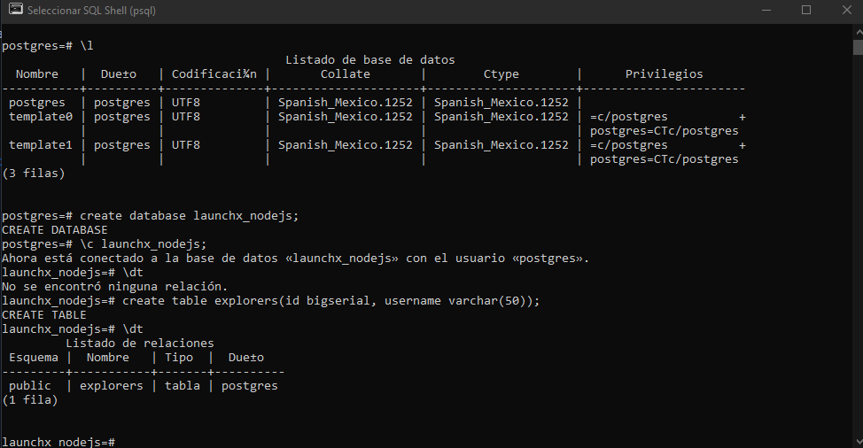
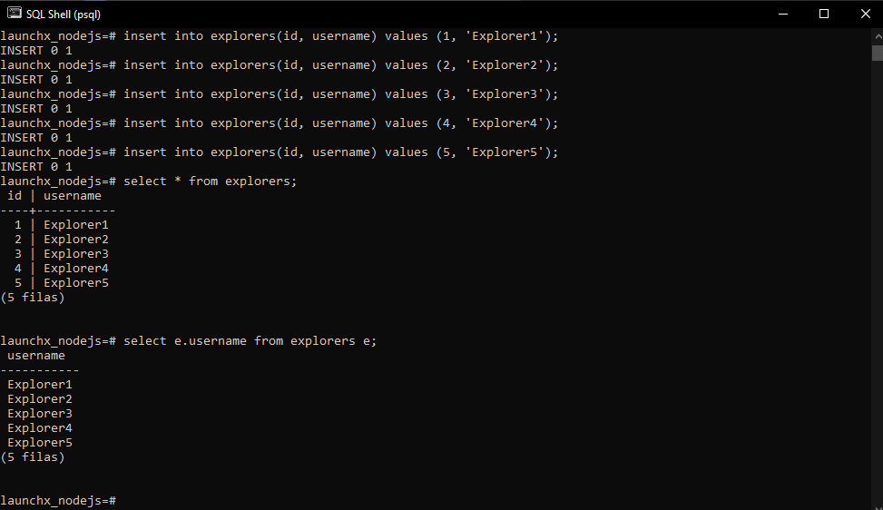
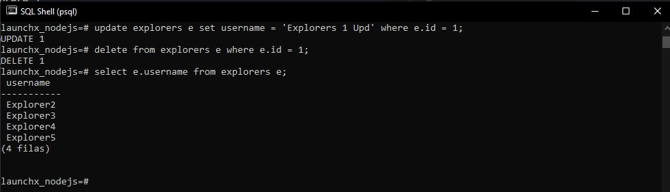

# Mini Tutorial de SQL

## Objetivos de la práctica

* Instalar Postgresql.
* Usar la línea de comando de Postgresql.
* Crear una db desde la terminal.
* Crear una tabla desde la terminal.
* Aprender a realizar las operaciones básicas: crear, actualizar, leer y eliminar.

## Instalación de Postgresql

* Para descargar e instalar el motor de base de datos relacional PostgreSQL: [https://www.postgresql.org/download/](https://www.postgresql.org/download/)

* Para la instalación se puede seguir la siguiente documentación: [Ver la documentación](https://www.enterprisedb.com/docs/supported-open-source/postgresql/installer/02_installing_postgresql_with_the_graphical_installation_wizard/01_invoking_the_graphical_installer/)

## Realizar operaciones básicas desde la consola
1. Una vez instalado se ingresa a la línea de comando de postgresql (Busca poder usar el comando `psql` en la terminal).
2. Se tiene que hacer login con el usuario que se creó durante la instalación.
3. Ejecuta el comando `\l` para ver todas las bases de datos locales.
4. Para crear nuestra primera base de datos utilizamos el siguiente comando: `create database launchx_nodejs;`
5. Seleccionamos la base de datos creada con el siguiente comando: `\c launchx_nodejs;`
6. Para listar las tablas creadas utilizamos el siguiente comando: `\dt`
7. Para crear una nueva tabla utilizamos el siguiente comando: `CREATE TABLE explorers(id bigserial, username varchar(50));`
8. Volvemos a ejecutar el comando para listar las tablas creadas, pero ahora se podrá observar la tabla `explorers`.



9. A continuación, se agregarán registros a la tabla creada anteriormente:
```
insert into explorers(id, username) values (1, 'Explorer1');
insert into explorers(id, username) values (2, 'Explorer2');
insert into explorers(id, username) values (3, 'Explorer3');
insert into explorers(id, username) values (4, 'Explorer4');
insert into explorers(id, username) values (5, 'Explorer5');
``` 
10. Para leer los registros agregados anteriormente utilizamos el siguiente comando: `select * from explorers;`
11. Para leer solo los nombres de todos los registros de la db: `select e.username from explorers e;`



12. Para actualizar el valor del primer nombre del explorer con el ID 1 se utiliza la siguiente setencia: `update explorers e set username = 'Explorer 1 Upd' where e.id = 1;`
13. Para eliminar el explorer con el ID 1: `delete from explorers e where e.id = 1;`
    Por último, podemos comprobar que el registro se ha eliminado utilizando la sentencia `select e.username from explorers e;`

